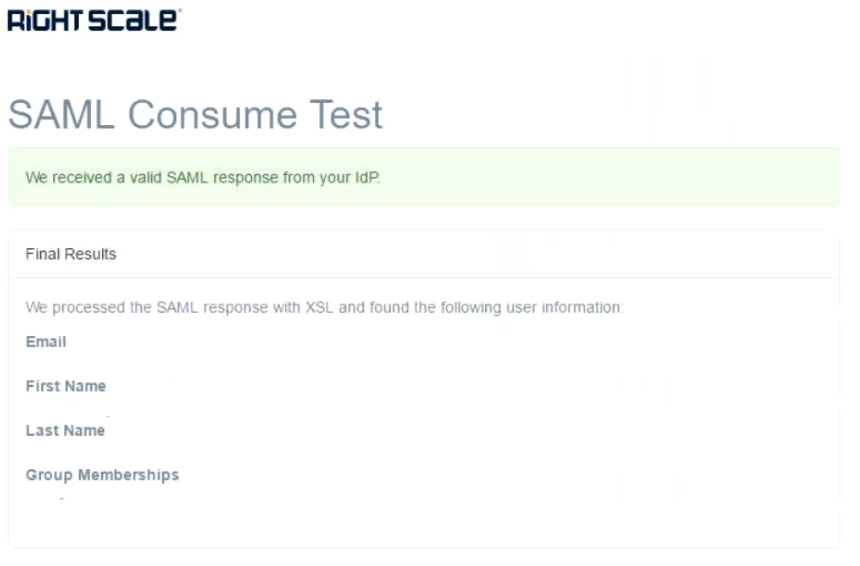

## Creating a trust relationship in Google SSO

In order to setup SSO between Google and RightScale, you need to configure SSO setup on Google first followed by setting it up on RightScale. We have summarized the instructions here but you can also follow [SAML-based Federated SSO](https://support.google.com/a/answer/6087519?hl=en&ref_topic=6304963)

### Set up your own SAML app

1. Click **Apps > SAML apps**.
1. Select the **Add a service/App to your domain** link or click the plus `(+)` icon in the bottom corner.
1. Click **Setup my own custom SAML App**. 
1. There are two ways to collect the service provider Setup information: 
	You can copy the **Entity ID** and the **Single Sign-On URL** field values and download the **X.509 Certificate**, paste them into the appropriate service provider Setup fields, and then click **Next** 
	**OR** 
	You can download the **IDP** metadata, upload it into the appropriate service provider Setup fields, and then  come back to the admin console and click **Next**.
1. In the Basic Application Information window, add an application name and description.
1. (Optional) Click **Choose file** next to the **Upload Logo** field to upload a PNG or GIF file to serve as an icon. The file size should be 256 pixels square.
1. As shown in the screenshot below, in the Service Provider Details window, enter the details. You can copy paste appropriate URLs from [RightScale SAML settings](/platform/guides/configuring_sso/#overview-saml-2-0-settings). 
	
1. Check **Signed Response** checkbox.
1. In the **Name ID Format** field, select **EMAIL** from the dropdown.
1. Click **Next**.
1. Ignore **Add new mapping** for now. We will set it up as part of [Step 2: Set up assertion mapping for user metadata](/platform/guides/configuring_sso/#detailed-instructions-step-2--set-up-assertion-mapping-for-user-metadata) later.
1. In the drop-down list, select the **Category** and **User attribute** to map the attribute from the G Suite profile.
1. Click **Finish**.

### Turn on SSO

1. Go to **Apps > SAML apps**.
2. Select your new SAML app. At the top of the gray box, click More Settings and choose: 
	* On for everyone to turn on the service for all users (click again to confirm). 
	* Off to turn off the service for all users (click again to confirm). 
	* On for some organizations to change the setting only for some users. 
3. Ensure that your user account email IDs match those in your G Suite domain.

### Verify SSO

1. Open the single sign-on URL for your new SAML app. You should be automatically redirected to the G Suite sign-in page.
1. Enter your sign-in credentials.
1. After your sign-in credentials are authenticated you will be automatically redirected back to your new SAML app.

	

## Creating a trust relationship in RightScale

In this section, we will set up a trust relationship for Google SSO within RightScale. As a result, RightScale will know your identity provider's information, which permits your IdP to initiate logins.

!!info*Note:*  You must have the "enterprise_manager" role for the RightScale account you wish to associate with Google SSO.

1. In a new tab in your browser, navigate to the account you wish to administer in RightScale.
1. In the blue nav menu at the top of the screen, select "Settings" and navigate to "Single Sign-on" under the "Enterprise" section. (If you do not see this option, then you do not have the "enterprise_manager" role for the current account.)
1. On the resulting page, you should see a list of existing SAML Identity Providers near the top and, above the list, you should see a "New" button. Click the "New" button.
1. In the resulting form, enter the following values:

    | Input Name | Value |
    | ---------- | ----- |
    | *Display Name* | Your choice, e.g. `MyCompany Google SSO` |
    | *Login Method* | Leave "Allow RightScale-initiated SSO using a discovery hint" unchecked |
    | *SAML SSO URL* | Enter Google SSOs' SAML request endpoint e.g. `https://accounts.google.com/o/saml2/idp?idpid=xxxxxxx`  |
    | *SAML EntityID* | Enter Google SSOs' entity ID e.g. `https://accounts.google.com/o/saml2?idpid=xxxxxxxx` |
    | *SAML Signing Certificate* | Upload the x509 certificate that Google SSO uses to sign its SAML assertions |

1. Click the "Save" button and you will be returned to the Identity Provider list page. You should see your newly created IdP in this list.
1. Next, click the button to the right to test your IdP configuration. You should be redirected to your IdP where you can log in and complete the SSO login.
1. Finally, if you wish to have new users provisioned via SSO then you will need to [Enable authority for your new IdP over the SAML-asserted email domains](../../saml/registering_idp_authority.html).

This concludes configuration of your SAML Identity Provider in RightScale. Please continue on to [Step 3: Test IdP-Initiated Single Sign-On](index.html#detailed-instructions-step-3--test-idp-initiated-single-sign-on).
