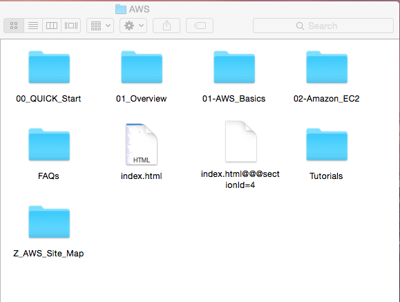
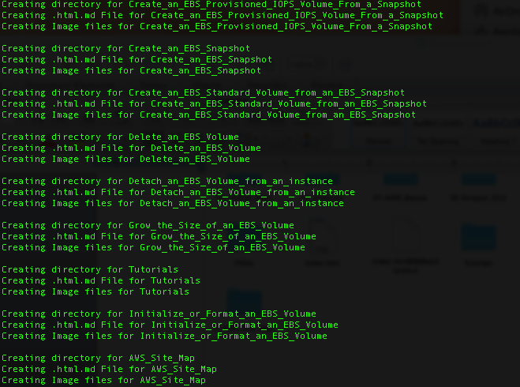
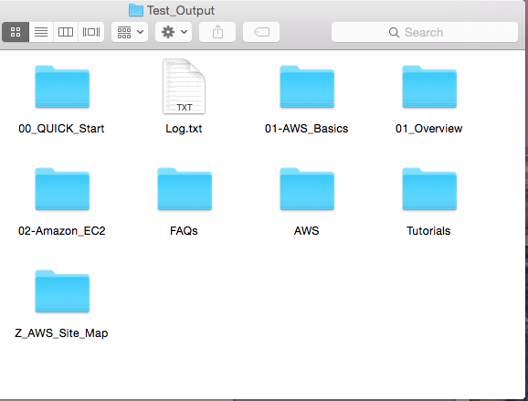
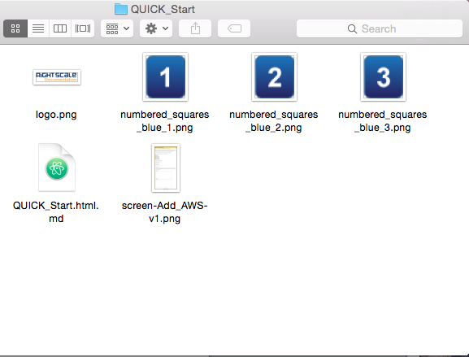

# About

The purpose of this script is to convert existing HTML content from support.rightscale.com into markdown format.

HTML_to_Markdown is a Ruby script that converts multiple HTML files into Markdown code. Given a tree of directories, HTML_to_Markdown will produce a recreation of the tree, replacing each HTML file with a folder with the name of the page for that HTML file. The script will only process an HTML file if it is called “index.html” This folder will contain a .html.md file with the converted markdown code as well as any images found inside the page. The script will only identify images in the format png, jpg, or gif. In addition to this a Log.txt file will be generated at the top level of the output tree. This file will display the success of each attempt to locate an image URL, with all failures being displayed at the top of the file.

# Setup

HTML_to_Markdown utilizes two specific ruby gems, Nokogiri and Reverse_Markdown. These gems are required to run the script and must be installed on your machine before running the script. The two gems can be installed using the following command in a terminal prompt:

Nokogiri:

(sudo) gem install nokogiri

Reverse_Markdown:

(sudo) gem install reverse-markdown

In addition to installing the required gems, a base URL variable must be modified in order to allow the script to run on your machine. The script works such that whenever an image url is encountered in the HTML code it retrieves the image from the old site repository and outputs the image. In order for this work a copy of the repository must be retrieved from github and stored on your machine. The base URL on line 35 must be modified to be the path to the repository.

# Use

In order to run the script, open a terminal window and navigate to the directory that contains the script. Once in the correct directory, run the following command to execute the script:

ruby HTML_to_Markdown.rb input1 input2

input1 should be given as the path to the tree of directories to be parsed for html files. Input2 should be given as the output directory in which the tree is recreated with converted markdown files.

# Example

 The HTML_to_Markdown script is capable of handling large trees of directories with HTML files. The following directory is taken from the AWS Clouds section of the old site:

 

This tree can be converted and output into a different directory called Test_Output by using the following example command:

 ruby HTML_to_Markdown.rb Documents/AWS Documents/Test_Output




The first input to the script is the path to the original AWS directory containing the HTML files. The second input given was a path to an empty folder called Test_Output. While the script runs, a series of status messages should show on the terminal screen. An example of these status messages would look like this:

 

Once the script has finished running the output folder should look something like the following:

 




The output folder looks almost identical to the input folder with the exceptions being that there exists a Log.txt file at the top level and the HTML files have been replaced with a folder named after the titles of the HTML pages that contains the markdown code and all images found inside the html code.

Diving into a folder created to replace an HTML file should look like this:

  


The QUICK_Start.html.md file contains all of the markdown code that was generated during the conversion. The png images shown are all of the images found on the site that the HTML code represents.
